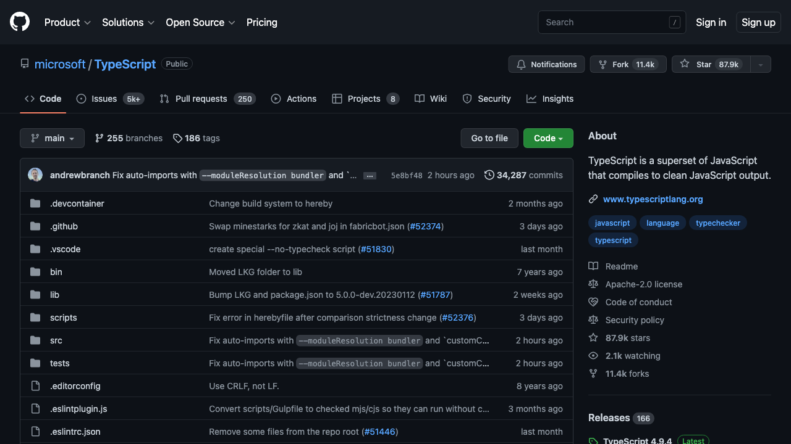
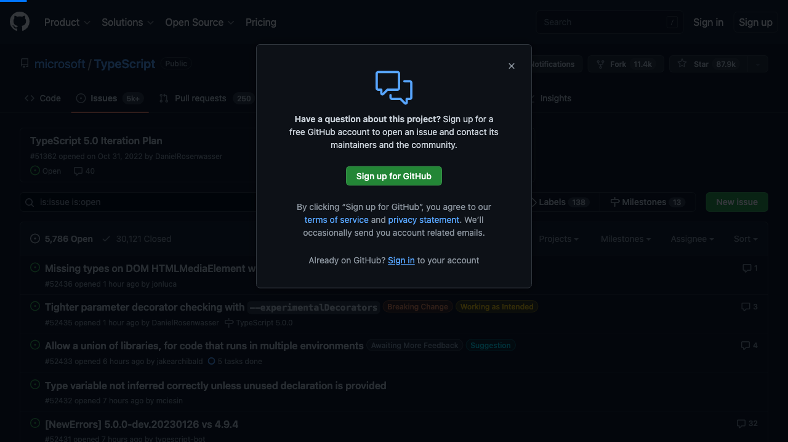

# CREATE A NEW GITHUB ISSUE  
  Go to [here](https://github.com/microsoft/TypeScript).      Click on the _link_ called **Issues**   Click on the _button_ called **New issue**   Click on the _dialog_ called **Sign up for GitHub**      <small>Generated by [Playwright Docs Creator]</small>